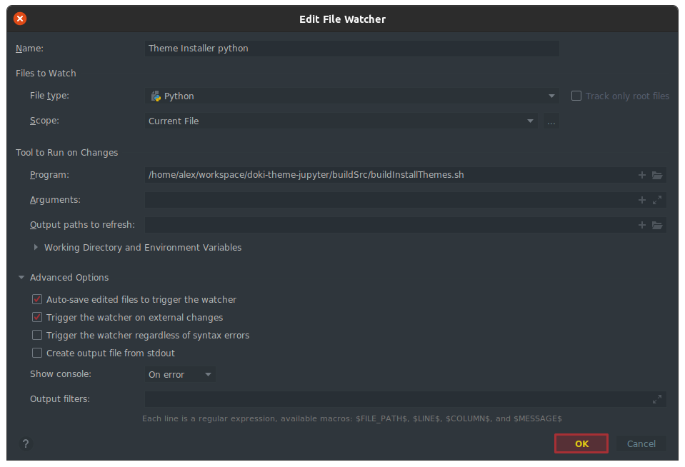
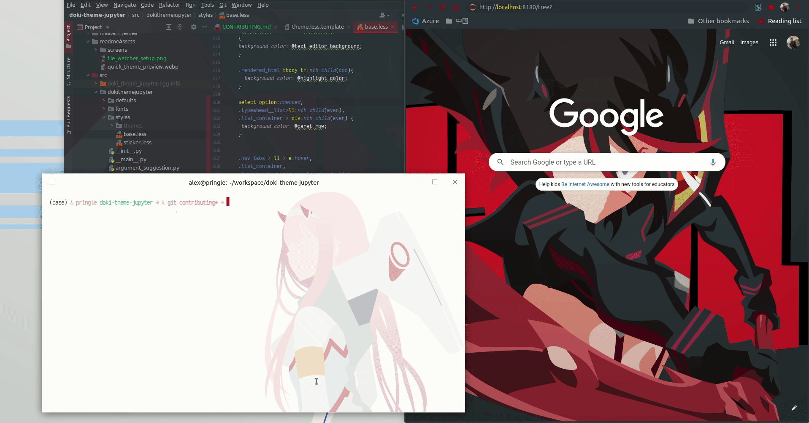

Contributing
---

# Outline

- [Build Process](#build-process-high-level-overview)
- [Getting Started](#getting-started)
- [Editing Themes](#editing-themes)
- [Creating New Themes](#creating-new-themes)

# Build Process High level overview

I won't go into the minor details of the theme building process, however I will talk about the high level details of
what is accomplished.

All themes have a base template that they inherit from. Themes have the ability to choose their inherited parent. Each
child has the ability to override any attributes defined by the parent. This mitigates any one-off issues for themes
that are not captured by the global shared style.

# Getting Started

If you haven't built a Python package before, then I would recommend going
through [this packaging tutorial](https://packaging.python.org/tutorials/packaging-projects/). This way you can become
more familiar with the process as a whole.

# Editing Themes

## Editing Themes Required Software

- Yarn package manager
- Node 14
- Python 3.7.3+
    - pip 21.0.1+

## Initial Setup

**Set up Python Stuff**

You'll need the required version of various python packages, to get this plugin to run. To accomplish this, you'll need
to run this command it the root of this repository:

```shell
pip install -r requirements.txt
```

**Set up Yarn Globals**

I heavily use Node/Typescript to build all of my themes, and I have a fair amount of global tools installed.

Just run

```shell
yarn global add typescript ts-node nodemon
```

Note: if you already have these globally installed please make sure you are up to date!

```shell
yarn global upgrade typescript ts-node
```

**Get the Master Themes**

Since this theme suite expands across multiple platforms, in order to maintain consistency of the look and feel across
platforms, there is a [central theme definition repository](https://github.com/doki-theme/doki-master-theme)

This repository needs to be cloned as a directory called `masterThemes`. If you are running Linux/MacOS, you can
run `getMasterThemes.sh` located at the root of this repository. This script does exactly what is required, if you are
on Windows, have you considered Linux? Just kidding (mostly), you'll need to run this command

```shell
git clone https://github.com/doki-theme/doki-master-theme.git masterThemes
```

Your directory structure should have at least these directories, (there will probably be more, but these are the
important ones to know).

```
your-workspace/
├─ doki-theme-jupyter/
│  ├─ masterThemes/
│  ├─ buildSrc/
```

Inside the `masterThemes` directory, you'll want to make sure all the dependencies are available to the build scripts.
To accomplish this, just run this command in the `masterThemes` directory.

```shell
yarn
```

### Set up build source

Navigate to the root of the `buildSource` directory and run the following command.

```shell
yarn
```

This will install all the required dependencies to run the theme build process.

You should be good to edit and add themes after that!

## Theme Editing Process

I have too many themes to maintain manually, so theme creation/maintenance is automated and shared common parts to
reduce overhead.

The standardized approach used by all the plugins supporting the Doki Theme suite, is that there is a `buildSrc`
directory.

Inside the `buildSrc` directory, there will be 2 directories:

- `src` - holds the code that builds the themes.
- `assets` - defines the platform specific assets needed to build the themes. This directory normally contains two child
  directories.
    - `themes` - holds the [application definitions](#application-specific-templates)
    - `templates` - if not empty, normally contains various text files that can be evaluated to replace variables with
      values. Some cases, they also contain templates for evaluating things such as look and feel, colors, and other
      things.

The `buildSrc` directory houses a `buildThemes` script that generates the application specific files necessary for apply
the Doki Theme Suite.

### Jupyter specifics

There is one file that is important, it can be found in `buildSrc/assets/templates`. That file is `theme.less.template`,
which is the template for the common CSS that used for all themes.

This template is evaluated as part of the theme building process. When you run this command in the `buildSrc`
directory:

```shell
yarn buildThemes
```

This template will be evaluated for each theme and be placed in the corresponding
directory `<repo-root>/src/dokithemejupyter/styles/themes` as a `*.less` file. When the user installs the theme, the
plugin will compile the less theme with the base template and with the various options and plop the CSS file in the
Jupyter styles directory.

There's also a `themes.py` file that gets generated as well. This contains all the theme information necessary for doing
stuff like listing themes and such.

Some themes have some one-off issues that can be fixed by adding some stuff to the `jupyter.definition.json` file. Here
is an example of adjusting
the [background anchoring](https://github.com/doki-theme/doki-theme-jupyter/blob/5c0ad47ef0635d5d477eb70ac1ec264a9d238295/buildSrc/assets/themes/typeMoon/gray/dark/gray.dark.jupyter.definition.json#L7)
so that Gray always shows up regardless of the window size :).

I haven't figured out a good way to test theme changes, so here's what I do.

1. Start up Jupyter in the root of this repository
    1. `jupyter notebook --port=8180 --ip=0.0.0.0` (Jupyter Notebook will be available at http://localhost:8180)
2. Add [file watchers](https://plugins.jetbrains.com/plugin/7177-file-watchers) to PyCharm
    1. The command that it runs is in `buildSrc/build`
    2. One for: python files, less files, text (template), & typescript
    3. 
3. Make changes to the various sources
4. Refresh the browser window Jupyter is running in
5. Contemplate life choices
6. Repeat steps 3-5 until satisfied.



# Creating New Themes

**IMPORTANT**! Do _not_ create brand new Doki-Themes using the Jupyter Plugin. New themes should be created from the
original JetBrains plugin which uses all the colors defined. There is also Doki Theme creation assistance provided by
the IDE as well.

Please follow
the [theme creation contributions in the JetBrains Plugin repository](https://github.com/doki-theme/doki-theme-jetbrains/blob/master/CONTRIBUTING.md#creating-new-themes)
for more details on how to build new themes.

## Creating Themes Required Software

- [Editing Themes required software](#editing-themes-required-software)

## Creating Setup

- Follow the [initial setup](#initial-setup)

## Theme Creation Process

This part is mostly automated, for the most part. There is only one script you'll need to run.

### Application specific templates

Once you have a new master theme definitions merged into the default branch, it's now time to generate the application
specific templates, which allow us to control individual theme specific settings.

You'll want to edit the function used by `buildApplicationTemplate`
and `appName` [defined here](https://github.com/doki-theme/doki-master-theme/blob/596bbe7b258c65e485257a14887ee9b4e0e8b659/buildSrc/AppThemeTemplateGenerator.ts#L79)
in your `masterThemes` directory.

In the case of this plugin the `buildApplicationsTemplate` should use the `jupyterTemplate` and `appName` should
be `jupyter`.

We need run the `generateTemplates` script. Which will walk the master theme definitions and create the new templates in
the `<repo-root>/buildSrc/assets/themes` directory (and update existing ones). In
the `<your-workspace>/doki-theme-jupyter/masterThemes` run this command:

```shell
yarn generateTemplates
```

The code defined in the `buildSrc/src` directory is part of the common Doki Theme construction suite. All other plugins
work the same way, just some details change for each plugin, looking at
you [doki-theme-web](https://github.com/doki-theme/doki-theme-web). This group of code exposes a `buildThemes` node
script.

This script does all the annoying tedious stuff such as:

- Evaluating the `buildSrc/assets/templates` from the templates and putting the user.css in the right place.
  See [Jupyter Specifics](#jupyter-specifics) for more details.

[Here is an example pull request that captures all the artifacts from the development process of imported themes](https://github.com/doki-theme/doki-theme-jupyter/pull/3)
.